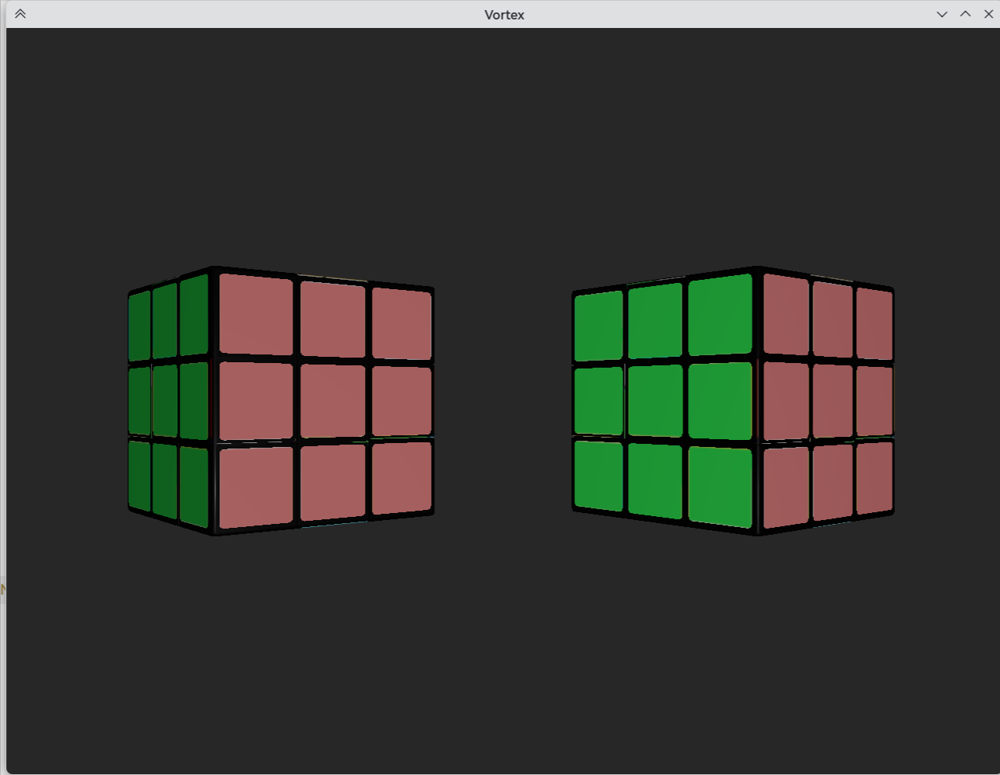

# Vortex

基于 Vulkan 的 PBR 渲染引擎，用于学习现代图形 API 和实时渲染技术。



## 特性

### 渲染

- **PBR 着色** — Cook-Torrance BRDF（GGX/Trowbridge-Reitz NDF、Schlick-GGX 几何遮蔽、Fresnel-Schlick）
- **HDR 色调映射** — Reinhard tone mapping + Gamma 校正
- **纹理映射** — Albedo / Normal / Metallic / Roughness / AO 五通道 PBR 材质
- **Mipmap 生成** — 运行时自动生成，支持各向异性过滤
- **深度测试** — 32-bit float 深度缓冲

### 引擎架构

- **Vulkan 1.4** — 现代 Vulkan API
- **C++23** — 使用 Concepts、`std::println` 等新特性
- **双帧同步** — Fence / Semaphore 实现帧间同步，2 frames in flight
- **VMA 内存管理** — Vulkan Memory Allocator 管理 GPU 显存
- **模板化 Descriptor** — 基于 `DescriptorTraits<T>` 的类型安全描述符管理
- **分层设计** — Core / Scene / Assets 三层解耦

### 场景

- **FPS 相机** — WASD 移动 + 鼠标视角
- **多光源支持** — Point / Directional / Spot / Area（框架已就绪）
- **层次化 Transform** — 父子节点、四元数旋转、脏标记缓存
- **OBJ 模型加载** — 基于 tinyobjloader，自动顶点去重

## 项目结构

```text
Vortex/
├── include/
│   ├── 3rd/              # 第三方头文件 (VMA, stb_image, tinyobjloader)
│   ├── Core/             # 渲染核心层
│   │   ├── Context.h     # Vulkan Instance / Device / Queue / Allocator
│   │   ├── Renderer.h    # 主渲染器，编排整个渲染流程
│   │   ├── Swapchain.h   # 交换链创建与重建
│   │   ├── Pipeline.h    # 图形管线管理
│   │   ├── RenderPass.h  # 配置驱动的 Render Pass 工厂
│   │   ├── Command.h     # 命令缓冲池与帧同步
│   │   ├── Descriptor.h  # 模板化描述符管理
│   │   ├── Window.h      # GLFW 窗口封装
│   │   └── Inputs.h      # 键盘 / 鼠标输入系统
│   ├── Scene/            # 场景层
│   │   ├── Scene.h       # 场景图容器
│   │   ├── Camera.h      # FPS 相机
│   │   ├── Transform.h   # 层次化变换
│   │   ├── Light.h       # 多类型光源
│   │   ├── Renderable.h  # Mesh + Material + Transform 绑定
│   │   └── UniformBuffer.h  # GPU UBO 结构体定义
│   ├── Assets/           # 资源层
│   │   ├── Mesh.h        # 网格（OBJ 加载、顶点/索引缓冲）
│   │   ├── Texture.h     # 纹理（加载、Mipmap、Sampler）
│   │   └── Material.h    # PBR 材质
│   └── Application.h     # 应用主循环与场景初始化
├── src/                  # 实现文件（与 include 镜像）
├── shaders/
│   ├── pbr.vert          # PBR 顶点着色器 (GLSL)
│   └── pbr.frag          # PBR 片段着色器 (GLSL)
├── assets/               # 模型与纹理资源
└── test/
    └── vortex.cpp        # 入口 main()
```

## 依赖

| 依赖 | 用途 | 来源 |
|------|------|------|
| Vulkan SDK ≥ 1.4 | 图形 API | 系统安装 |
| GLFW 3 | 窗口与输入 | `find_package` |
| GLM | 数学库 | `find_package` |
| Vulkan Memory Allocator | 显存管理 | 头文件内置 (`include/3rd/`) |
| stb_image | 图像加载 | 头文件内置 (`include/3rd/`) |
| tinyobjloader | OBJ 模型加载 | 头文件内置 (`include/3rd/`) |

## 构建

要求 CMake ≥ 3.25、支持 C++23 的编译器（GCC ≥ 13 / Clang ≥ 17）。

```bash
# 配置
cmake -B build -DCMAKE_BUILD_TYPE=Debug

# 编译
cmake --build build -j$(nproc)

# 运行
./bin/vortex
```

## 操作

| 按键           | 功能                         |
| -------------- | ---------------------------- |
| W / A / S / D  | 前后左右移动                 |
| 鼠标移动       | 视角旋转（左键点击捕获鼠标） |
| ESC / 右键     | 释放鼠标                     |
| R              | 重置相机位置                 |

## 学习资源

- [Vulkan Tutorial](https://vulkan-tutorial.com/) — Vulkan 入门教程
- [Learn OpenGL - PBR Theory](https://learnopengl.com/PBR/Theory) — PBR 理论详解
- [Vulkan Specification](https://registry.khronos.org/vulkan/specs/1.3/html/) — Vulkan 规范

## 许可证

MIT License
